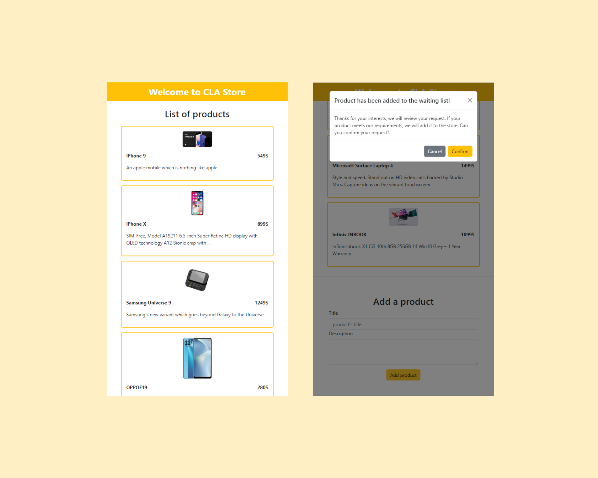

# Code Labs Academy - Online Store Example

## About this repository

This repository contains the code for a fake web store for selling phones using only bootstrap of the web development bootcamp offered by [Code Labs Academy](https://codelabsacademy.com/). In this unit, we learn the major concepts of HTML, CSS and JavaScript while providing challenges and homeworks for an optimal hands-on learning experience.

    

## Concepts covered

This example focuses mainly on the following concepts:

- Bootstrap Layout.
- Bootstrap Forms
- Bootstrap Modals.

Here you can find the official documentation of [Bootstrap](https://getbootstrap.com/docs/5.0/getting-started/introduction/)

**Happy learning! 😄**
